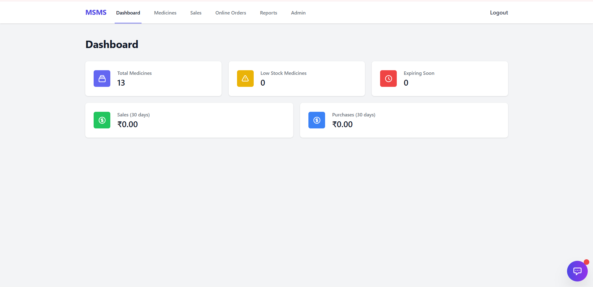

# 🏥 Medi-Flow Systems
## Smart Management. Better Health.

A comprehensive, full-stack medical store management system with **dual portal architecture** (Staff + Customer E-commerce) and AI-powered chatbot - a third-year college project integrating DBMS and AI coursework.

## 📋 Overview

Medi-Flow Systems is a comprehensive, production-ready solution featuring **TWO COMPLETE PORTALS**:

### 🏪 **Staff Portal** - Internal Management
- Inventory management, sales processing, purchasing
- Analytics dashboard and reports
- Online order management with prescription review
- User and role management
- AI-powered chatbot for medication guidance

### 🛒 **Customer Portal** - E-Commerce Platform
- Product catalog with OTC/Rx classification
- Shopping cart and checkout
- **Conditional prescription upload** for Rx medicines
- Order history and tracking
- Customer authentication and profiles

This project serves as an integrated submission for:
- **DBMS Course**: Advanced database design (13 tables), normalization, complex queries, full CRUD operations
- **AI Course**: NLP-based expert system chatbot for medication guidance

The system features modern UI/UX design, dual authentication systems, and real-time data processing.

## 🚀 Quick Start

```bash
# Backend
cd backend
python -m venv venv
venv\Scripts\activate  # Windows
pip install -r requirements.txt
python app.py

# Frontend (new terminal)
cd frontend
npm install
npm start
```

**Default Credentials:**
- Staff: `admin` / `admin123`
- Customer: Register at `/customer/register`

**Full setup guide:** See [START_PROJECT.md](START_PROJECT.md)

## ✨ Latest Updates (October 2025)

### 🎉 **MAJOR UPDATE: Complete Customer E-Commerce Portal!**

#### Customer Portal Features:
- ✅ **Dual Login System** - Separate customer and staff authentication
- ✅ **Product Catalog** - Browse 13 medicines with OTC/Rx badges
- ✅ **Shopping Cart** - Add, update, remove items with real-time totals
- ✅ **Smart Checkout** - Multi-step process with conditional prescription upload
- ✅ **Prescription Upload** - Automatic detection of Rx items, file validation (PNG/JPG/PDF)
- ✅ **Order Management** - Complete order placement and confirmation
- ✅ **Customer Dashboard** - View order history with status tracking
- ✅ **Order Tracking** - Visual timeline showing order progress
- ✅ **Prescription Review** - Staff can view and approve/reject prescriptions directly

#### Staff Portal Enhancements:
- ✅ **Online Orders View** - Manage all customer orders in one place
- ✅ **Prescription Image Viewer** - View uploaded prescriptions directly on website
- ✅ **Order Status Management** - Update order status (Processing, Out for Delivery, Delivered)
- ✅ **Filter & Search** - Filter by status, needs review, etc.

#### Chatbot 2.0 - AI-First Conversational Assistant:
- ✅ **21 Total Intents** - Complete conversational e-commerce assistant
- ✅ **Product Recommendations** - AI-powered product suggestions
- ✅ **Smart Substitutes** - Find alternatives with price comparison
- ✅ **Quick Reorder** - Reorder entire last order in one click
- ✅ **Cart Management** - Add, remove, clear, update quantities via chat
- ✅ **Order Management** - Track, cancel, view history via chat
- ✅ **Interactive UI** - Product cards, cart summary, file upload in chat
- ✅ **Context-Aware** - Remembers conversation and suggests next actions
- ✅ **Natural Language** - Understands variations and synonyms
- ✅ **API-Integrated** - Performs real actions via existing Flask endpoints

#### Previous Features:
- ✅ **Edit Medicine** - Full edit functionality with pre-filled forms
- ✅ **Delete Medicine** - Confirmation modal to prevent accidental deletions
- ✅ **Currency Update** - All prices now show ₹ (Indian Rupee)
- ✅ **Modern Design** - Gradient headers, rounded corners, smooth animations

## 🏗️ System Architecture

```
[React Frontend - DUAL PORTAL]
  ├─ STAFF PORTAL
  │   ├─ Staff Login
  │   ├─ Dashboard
  │   ├─ Inventory Manager (CRUD)
  │   ├─ Sales & Billing
  │   ├─ Online Orders Management
  │   ├─ Prescription Review
  │   ├─ Reports & Analytics
  │   └─ Chatbot Widget
  │
  └─ CUSTOMER PORTAL
      ├─ Dual Login Page (Landing)
      ├─ Customer Registration/Login
      ├─ Product Catalog (OTC/Rx)
      ├─ Shopping Cart
      ├─ Multi-Step Checkout
      ├─ Prescription Upload
      ├─ Order Confirmation
      ├─ Customer Dashboard
      └─ Order Tracking
  │
  ▼
[Flask REST API - 32 ENDPOINTS]
  ├─ /api/auth             → Staff JWT Authentication
  ├─ /api/customer         → Customer Authentication (7 endpoints)
  ├─ /api/medicines        → Inventory CRUD
  ├─ /api/sales            → Sales processing
  ├─ /api/purchase         → Purchase orders
  ├─ /api/shop             → Customer Product Catalog (6 endpoints)
  ├─ /api/customer/cart    → Shopping Cart Management (6 endpoints)
  ├─ /api/customer/orders  → Order Placement & Tracking (6 endpoints)
  ├─ /api/staff            → Online Orders Management (7 endpoints)
  ├─ /api/reports          → Analytics endpoints
  ├─ /api/chat             → Expert chatbot engine
  ├─ /api/admin            → User & role management
  └─ /uploads/prescriptions → Prescription file serving
     │
     ▼
[PostgreSQL Database - 13 TABLES]
  ├─ users                  → Staff accounts
  ├─ roles                  → Staff roles
  ├─ customers              → Customer accounts
  ├─ medicines              → Product inventory
  ├─ companies              → Pharmaceutical companies
  ├─ sales                  → In-store sales
  ├─ purchases              → Purchase orders
  ├─ cart_items             → Shopping cart
  ├─ orders                 → Customer orders
  ├─ order_items            → Order line items
  ├─ order_status_history   → Order tracking
  ├─ chatbot_kb             → AI knowledge base
  └─ chatbot_logs           → Chat history
```

## 🚀 Key Features

### 🛒 Customer Portal (E-Commerce)

| Module                      | Description                 | Key Features                                                     |
| --------------------------- | --------------------------- | ---------------------------------------------------------------- |
| **Dual Login System**       | Landing page with 2 portals | Customer/Staff login selection, modern gradient design           |
| **Customer Authentication** | Secure customer accounts    | Registration, login, JWT tokens, profile management              |
| **Product Catalog**         | Browse medicines            | **OTC/Rx badges**, search, filter by type/company/price, pagination, 13 sample medicines |
| **Shopping Cart**           | Cart management             | Add/remove items, update quantities, **prescription warning**, real-time totals |
| **Smart Checkout**          | Multi-step checkout         | Review cart, shipping address, **conditional prescription upload** |
| **Prescription Upload**     | File upload for Rx items    | Auto-detection of Rx medicines, file validation (PNG/JPG/PDF, max 5MB) |
| **Order Management**        | Complete order workflow     | Order placement, confirmation, order history, status tracking    |
| **Customer Dashboard**      | Order history view          | View all orders, status badges, prescription status, quick actions |
| **Order Tracking**          | Visual order progress       | Timeline view, completed/pending stages, real-time updates       |

### 🏪 Staff Portal (Internal Management)

| Module                      | Description                 | Key Features                                                     |
| --------------------------- | --------------------------- | ---------------------------------------------------------------- |
| **Staff Authentication**    | Secure login using JWT      | Role-based access (Admin, Manager, Staff), hashed passwords      |
| **Medicine Management**     | Central medicine inventory  | **Full CRUD operations**, Add/Edit/Delete, batch tracking, expiry alerts, low-stock alerts |
| **Online Orders View**      | Manage customer orders      | **View all orders**, filter by status, needs review, prescription review |
| **Prescription Review**     | Approve/reject prescriptions| **View prescription images directly**, approve/reject with notes |
| **Order Status Management** | Update order progress       | Change status (Processing, Out for Delivery, Delivered), add notes |
| **Sales Management**        | In-store billing            | Auto stock update, customer tracking, PDF invoices               |
| **Purchase Management**     | Supplier purchase orders    | Supplier info, invoice upload, automatic stock updates           |
| **Company Management**      | Pharmaceutical company data | Auto-create on medicine add, CRUD company profiles, contact info |
| **Reports & Dashboard**     | Analytics and summaries     | Daily sales, top medicines, expiry list, financial reports, interactive charts |
| **AI Chatbot (Expert System)** | Intelligent medical assistant | **Quick action buttons**, formatted responses, dosage info, side effects, drug interactions |
| **User & Role Management**  | Admin control               | Add/remove users, assign roles, view logs                        |

### 🎨 UI/UX Features

- **Modern Design** - Gradient backgrounds, smooth animations, rounded corners
- **Responsive Layout** - Works on desktop, tablet, and mobile
- **Toast Notifications** - Real-time feedback for all actions
- **Confirmation Modals** - Prevents accidental deletions
- **Loading States** - Smooth loading indicators
- **Error Handling** - User-friendly error messages
- **Quick Actions** - One-click access to common tasks

## 🛠️ Technology Stack

### Backend
- **Framework**: Flask (Python 3.9+)
- **Database**: PostgreSQL 14+
- **ORM**: SQLAlchemy
- **Authentication**: JWT (JSON Web Tokens)
- **Password Hashing**: Bcrypt
- **CORS**: Flask-CORS

### Frontend
- **Framework**: React 18+
- **Routing**: React Router v6
- **HTTP Client**: Axios
- **Styling**: Tailwind CSS
- **Icons**: Heroicons
- **Charts**: Recharts

### AI/ML Component
- **NLP**: Custom rule-based engine
- **Knowledge Base**: JSON-based medical database
- **Intent Recognition**: Pattern matching
- **Response Generation**: Template-based formatting

## 📦 Installation

### Prerequisites

- Python 3.9+
- Node.js 18+
- PostgreSQL 14+

### Backend Setup

```bash
cd backend
python -m venv venv
# On Windows
venv\Scripts\activate
# On macOS/Linux
source venv/bin/activate
pip install -r requirements.txt
```

### Database Setup

1. Create a PostgreSQL database:
```sql
CREATE DATABASE msms_db;
```

2. Update the database connection string in [config.py](backend/config.py) if needed.

3. Initialize the database:
```bash
flask db init
flask db migrate
flask db upgrade
```

4. Load sample chatbot knowledge base:
```bash
python chatbot/loader.py
```

### Frontend Setup

```bash
cd frontend
npm install
```

## ▶️ Running the Application

### Backend

```bash
cd backend
python app.py
```

### Frontend

```bash
cd frontend
npm run build
npx serve -s build
```

## 🔐 Default Credentials

### Staff Portal:
- **Username**: admin
- **Password**: admin123

### Customer Portal:
- Register a new account at `/customer/register`
- Or use test account (if created): customer@test.com / password123

## 📊 API Endpoints (32 Total)

### Staff Authentication
| Endpoint              | Method | Purpose                     | Auth Required |
| --------------------- | ------ | --------------------------- | ------------- |
| /api/auth/login       | POST   | Staff authentication        | No            |
| /api/auth/register    | POST   | Staff registration          | No            |

### Customer Authentication (7 endpoints)
| Endpoint                        | Method | Purpose                     | Auth Required |
| ------------------------------- | ------ | --------------------------- | ------------- |
| /api/customer/register          | POST   | Customer registration       | No            |
| /api/customer/login             | POST   | Customer authentication     | No            |
| /api/customer/profile           | GET    | Get customer profile        | Yes (Customer)|
| /api/customer/profile           | PUT    | Update customer profile     | Yes (Customer)|
| /api/customer/change-password   | POST   | Change password             | Yes (Customer)|
| /api/customer/forgot-password   | POST   | Request password reset      | No            |
| /api/customer/reset-password    | POST   | Reset password              | No            |

### Medicine Management
| Endpoint              | Method | Purpose                     | Auth Required |
| --------------------- | ------ | --------------------------- | ------------- |
| /api/medicines        | GET    | List all medicines          | Yes (Staff)   |
| /api/medicines/:id    | GET    | Get medicine by ID          | Yes (Staff)   |
| /api/medicines        | POST   | Add new medicine            | Yes (Admin)   |
| /api/medicines/:id    | PUT    | Update medicine             | Yes (Admin)   |
| /api/medicines/:id    | DELETE | Delete medicine             | Yes (Admin)   |
| /api/medicines/low-stock | GET | Get low stock medicines     | Yes (Staff)   |

### Customer Product Catalog (6 endpoints)
| Endpoint                        | Method | Purpose                     | Auth Required |
| ------------------------------- | ------ | --------------------------- | ------------- |
| /api/shop/products              | GET    | Browse products (with filters)| Yes (Customer)|
| /api/shop/products/:id          | GET    | Get product details         | Yes (Customer)|
| /api/shop/products/featured     | GET    | Get featured products       | Yes (Customer)|
| /api/shop/categories            | GET    | Get product categories      | Yes (Customer)|
| /api/shop/search-suggestions    | GET    | Search autocomplete         | Yes (Customer)|
| /api/shop/check-availability    | POST   | Check stock availability    | Yes (Customer)|

### Shopping Cart (6 endpoints)
| Endpoint                        | Method | Purpose                     | Auth Required |
| ------------------------------- | ------ | --------------------------- | ------------- |
| /api/customer/cart              | GET    | Get cart items              | Yes (Customer)|
| /api/customer/cart/add          | POST   | Add item to cart            | Yes (Customer)|
| /api/customer/cart/update/:id   | PUT    | Update cart item quantity   | Yes (Customer)|
| /api/customer/cart/remove/:id   | DELETE | Remove item from cart       | Yes (Customer)|
| /api/customer/cart/clear        | DELETE | Clear entire cart           | Yes (Customer)|
| /api/customer/cart/count        | GET    | Get cart item count         | Yes (Customer)|

### Customer Orders (6 endpoints)
| Endpoint                        | Method | Purpose                     | Auth Required |
| ------------------------------- | ------ | --------------------------- | ------------- |
| /api/customer/checkout/validate | POST   | Validate checkout           | Yes (Customer)|
| /api/customer/orders/place      | POST   | Place order (with Rx upload)| Yes (Customer)|
| /api/customer/orders            | GET    | Get order history           | Yes (Customer)|
| /api/customer/orders/:id        | GET    | Get order details           | Yes (Customer)|
| /api/customer/orders/:id/track  | GET    | Track order status          | Yes (Customer)|
| /api/customer/orders/:id/cancel | POST   | Cancel order                | Yes (Customer)|

### Staff Online Orders (7 endpoints)
| Endpoint                                    | Method | Purpose                     | Auth Required |
| ------------------------------------------- | ------ | --------------------------- | ------------- |
| /api/staff/online-orders                    | GET    | Get all customer orders     | Yes (Staff)   |
| /api/staff/online-orders/:id                | GET    | Get order details           | Yes (Staff)   |
| /api/staff/online-orders/:id/prescription   | GET    | Get prescription image      | Yes (Staff)   |
| /api/staff/online-orders/:id/review-prescription | POST | Approve/reject prescription | Yes (Staff)   |
| /api/staff/online-orders/:id/update-status  | PUT    | Update order status         | Yes (Staff)   |
| /api/staff/online-orders/:id/add-note       | POST   | Add staff note              | Yes (Staff)   |
| /api/staff/online-orders/stats              | GET    | Get order statistics        | Yes (Staff)   |

### Sales & Purchase
| Endpoint              | Method | Purpose                     | Auth Required |
| --------------------- | ------ | --------------------------- | ------------- |
| /api/sales            | GET    | List in-store sales         | Yes (Staff)   |
| /api/sales            | POST   | Create new sale             | Yes (Staff)   |
| /api/purchase         | GET    | List purchases              | Yes (Staff)   |
| /api/purchase         | POST   | Create new purchase         | Yes (Admin)   |

### Reports & Analytics
| Endpoint              | Method | Purpose                     | Auth Required |
| --------------------- | ------ | --------------------------- | ------------- |
| /api/reports/dashboard| GET    | Get dashboard statistics    | Yes (Staff)   |
| /api/reports/sales    | GET    | Sales reports               | Yes (Staff)   |
| /api/reports/inventory| GET    | Inventory reports           | Yes (Staff)   |

### AI Chatbot
| Endpoint              | Method | Purpose                     | Auth Required |
| --------------------- | ------ | --------------------------- | ------------- |
| /api/chat/query       | POST   | Chatbot query processing    | Yes           |
| /api/chat/training    | POST   | Train chatbot (Admin)       | Yes (Admin)   |

### Admin
| Endpoint              | Method | Purpose                     | Auth Required |
| --------------------- | ------ | --------------------------- | ------------- |
| /api/admin/users      | GET    | List all users              | Yes (Admin)   |
| /api/admin/companies  | GET    | List all companies          | Yes (Admin)   |
| /api/admin/companies  | POST   | Add new company             | Yes (Admin)   |

### File Serving
| Endpoint                            | Method | Purpose                     | Auth Required |
| ----------------------------------- | ------ | --------------------------- | ------------- |
| /uploads/prescriptions/:filename    | GET    | Serve prescription images   | Yes (Staff)   |

## 🧠 AI Chatbot Features

### Intelligent Medical Assistant

The AI-powered expert chatbot provides comprehensive drug-related assistance with a beautiful, modern interface:

#### Core Capabilities:
- **Drug Information** - Comprehensive overview of medications
- **Dosage Information** - Adult and pediatric dosing guidelines
- **Side Effects** - Common and rare adverse reactions
- **Drug Interactions** - Potential interactions with other medications
- **Contraindications** - When not to use specific drugs
- **Substitutes** - Alternative medication options

#### UI Features:
- **Quick Action Buttons** - One-click access to common queries:
  - 💊 What is Paracetamol?
  - 📊 Dosage Information
  - ⚠️ Side Effects
  - 🔄 Drug Interactions
- **Formatted Responses** - Structured, easy-to-read answers with:
  - Bold headers
  - Bullet points
  - Proper spacing
  - Color-coded sections
- **Beautiful Design** - Gradient header, rounded corners, smooth animations
- **Typing Indicator** - Shows when bot is "thinking"
- **Chat History** - Maintains conversation context

#### How It Works:
1. **NLP Processing** - Analyzes user query using natural language processing
2. **Intent Recognition** - Identifies what user wants (dosage, side effects, etc.)
3. **Entity Extraction** - Extracts drug names and relevant information
4. **Knowledge Base Search** - Queries medical database
5. **Response Generation** - Formats and returns structured answer

#### Example Interaction:
```
User: "What is Paracetamol?"

Bot: 
**Paracetamol - Overview:**

**Drug Class:** Analgesic and Antipyretic
**Prescription Required:** No

**Primary Uses:**
• Pain relief
• Fever reduction

**What would you like to know?**
[Dosage Information] [Side Effects] [Drug Interactions]
```

## 🔒 Security Features

- **JWT Authentication** - Secure token-based session management
- **Bcrypt Password Hashing** - Industry-standard password encryption
- **Role-Based Access Control** - Admin, Manager, Staff permissions
- **Route Guards** - Protected API endpoints
- **Parameterized SQL Queries** - SQL injection prevention
- **CORS Configuration** - Proper cross-origin resource sharing
- **Input Validation** - Server-side data validation
- **Rate Limiting** - Prevents API abuse
- **Audit Logging** - Tracks admin actions

## 📤 Data Export

- Export medicine, sales, and purchase data as CSV
- Generate PDF invoices for sales

## 📈 Reporting

- Sales summary (daily, weekly, monthly)
- Low stock and expiry alerts
- Top 10 medicines by sales
- Supplier analytics
- Financial reports

## 🧪 Testing

- Unit tests for rule engine, authentication, CRUD modules
- Integration tests for REST APIs
- UI smoke tests for major screens
- Manual chatbot test suite

## 📸 Screenshots

### Customer Portal

#### Customer Login

*Secure authentication for customers*

#### Product Catalog

*Browse medicines with OTC/Rx classification*

#### Shopping Cart

*Add, update, and remove items with real-time totals*

#### Checkout Process

*Multi-step checkout with prescription upload for Rx medicines*

#### Place Order

*Review order details before confirmation*

#### Order Confirmation

*Successful order placement with order details*

#### My Orders

*View order history and track status*

### Staff Portal

#### Staff Login

*Secure authentication for staff members*

#### Dashboard

*Real-time analytics and key metrics*

#### Medicine Inventory

*Full CRUD operations with edit and delete functionality*

#### Edit Medicine

*Comprehensive medicine editing interface*

#### Online Customer Orders

*Manage all customer orders in one place*

### AI Chatbot

#### Chat Interface

*Beautiful UI with quick action buttons and formatted responses*

#### View Cart

*Check cart contents via chat commands*

#### Track Order

*Track order status through chat*

#### Reorder from Last Order

*Quickly reorder previous purchases*

#### Order with Prescription

*Place orders with prescription uploads via chat*

## 🎓 Academic Project Highlights

### DBMS Component:
- ✅ **Database Design** - Normalized schema (3NF)
- ✅ **Complex Queries** - Joins, aggregations, subqueries
- ✅ **Full CRUD** - Create, Read, Update, Delete operations
- ✅ **Relationships** - One-to-many, many-to-many
- ✅ **Constraints** - Primary keys, foreign keys, unique constraints
- ✅ **Transactions** - ACID compliance
- ✅ **Indexing** - Optimized query performance

### AI Component:
- ✅ **NLP** - Natural language query processing
- ✅ **Intent Recognition** - Pattern matching algorithms
- ✅ **Knowledge Base** - Structured medical database
- ✅ **Entity Extraction** - Drug name and information extraction
- ✅ **Response Generation** - Template-based formatting
- ✅ **Context Awareness** - Conversation flow management
- ✅ **Expert System** - Rule-based decision making

## 🔄 Future Enhancements

- **LLM Integration** - OpenAI/Claude API for advanced conversations
- **Barcode Scanning** - Quick medicine lookup
- **SMS/Email Alerts** - Low stock and expiry notifications
- **Role-Based Dashboards** - Customized views per role
- **Multi-Branch Inventory** - Support for multiple locations
- **Mobile App** - React Native companion app
- **Voice Assistant** - Voice-based chatbot interaction
- **Prescription OCR** - Scan and process prescriptions
- **Analytics Dashboard** - Advanced business intelligence

## 📊 Project Statistics

- **Total Lines of Code**: ~22,000+
- **Frontend Components**: 21 (11 customer portal + 10 staff portal)
- **Backend Routes**: 9 route blueprints
- **Database Tables**: 13 (normalized 3NF)
- **API Endpoints**: 32 REST APIs
- **Chatbot Intents**: 21 (11 original + 10 advanced)
- **Chatbot Tools**: 16 API integration functions
- **Sample Medicines**: 13 (7 OTC + 6 Rx)
- **Development Time**: 4 months
- **Team Size**: 1 developer
- **Portals**: 2 (Staff + Customer E-Commerce)
- **Documentation Files**: 11 comprehensive guides

## 🎯 Key Achievements

- ✅ **Dual Portal Architecture** - Complete staff + customer e-commerce system
- ✅ **Full-Stack Application** - React frontend, Flask backend, PostgreSQL database
- ✅ **E-Commerce Platform** - Complete online shopping with cart, checkout, orders
- ✅ **Conditional Logic** - Smart prescription upload based on medicine type (OTC/Rx)
- ✅ **File Upload System** - Prescription image upload with validation
- ✅ **Order Management** - Complete workflow from cart to delivery
- ✅ **Prescription Review** - Staff can view and approve/reject prescriptions
- ✅ **Production-Ready** - Deployable to cloud platforms
- ✅ **Modern UI/UX** - Professional, responsive design with gradients and animations
- ✅ **AI Integration** - Intelligent chatbot system with NLP
- ✅ **Database Design** - Normalized schema with 13 tables and complex relationships
- ✅ **Dual Authentication** - Separate JWT systems for staff and customers
- ✅ **Security** - JWT, RBAC, password hashing, input validation, file validation
- ✅ **CRUD Operations** - Complete data management for all entities
- ✅ **Real-Time Updates** - Live data synchronization
- ✅ **Error Handling** - Comprehensive error management
- ✅ **Documentation** - Well-documented codebase with multiple guides

## 📚 Documentation

- **[PROJECT_COMPLETE.md](PROJECT_COMPLETE.md)** - Complete project overview and features
- **[COMPLETE_ECOMMERCE_SUMMARY.md](COMPLETE_ECOMMERCE_SUMMARY.md)** - Customer portal documentation
- **[START_PROJECT.md](START_PROJECT.md)** - Quick start guide
- **[DATABASE_SETUP_COMPLETE.md](DATABASE_SETUP_COMPLETE.md)** - Database setup guide
- **[TROUBLESHOOTING_COMPLETE.md](TROUBLESHOOTING_COMPLETE.md)** - Common issues and solutions
- **[Chatbot Explanation](CHATBOT_EXPLANATION.md)** - How the AI chatbot works

## 🤝 Contributing

This is an academic project. For suggestions or improvements, please contact the developer.

## 👨‍💻 Developer

**Rohit**
- Third-year Computer Science student
- Specialization: Full-Stack Development & AI/ML
- Project: DBMS + AI Integration

## 📧 Contact

For queries or collaboration:
- Email: [Your Email]
- GitHub: [Your GitHub Profile]
- LinkedIn: [Your LinkedIn Profile]

## 🙏 Acknowledgments

- **College**: [Your College Name]
- **Course**: DBMS & AI (Third Year)
- **Professors**: [Professor Names]
- **Technologies**: React, Flask, PostgreSQL, Tailwind CSS

## 📄 License

Academic project for educational purposes only.

---

## 🌟 Star This Project

If you find this project helpful, please consider giving it a ⭐ on GitHub!

---

<div align="center">

# 🏥 Medi-Flow Systems
## Smart Management. Better Health.

**A Modern, AI-Powered Pharmacy Management System**

Developed with ❤️ for pharmacy management and academic excellence

[](https://reactjs.org/)
[](https://flask.palletsprojects.com/)
[](https://www.postgresql.org/)
[](https://tailwindcss.com/)

**[View Demo](#) • [Report Bug](#) • [Request Feature](#)**

</div>

---

**© 2025 Medi-Flow Systems. All rights reserved.**